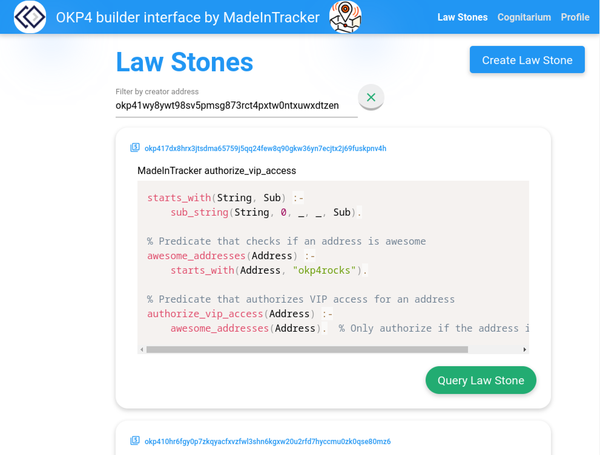
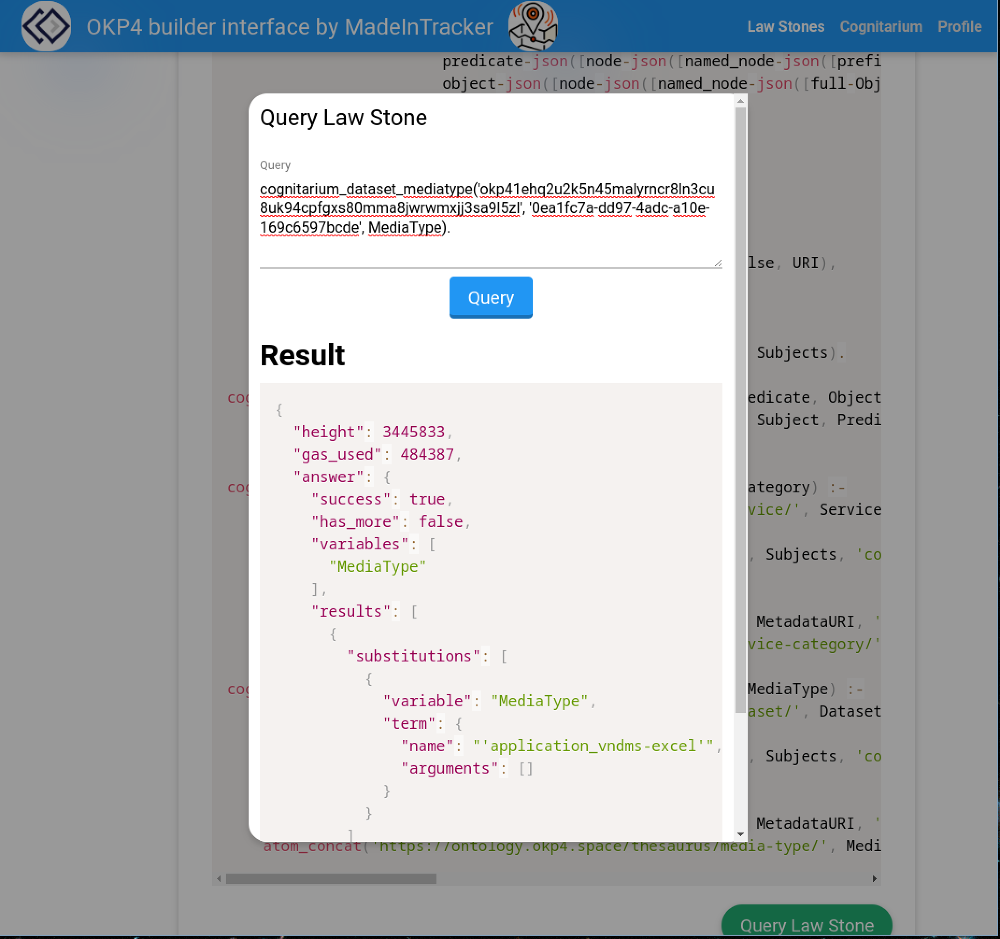

# OKP4 Builder interface

By [MadeInTracker](https://www.madeintracker.com/)

OKP4 address:
[okp41wy8ywt98sv5pmsg873rct4pxtw0ntxuwxdtzen](https://explore.okp4.network/OKP4%20testnet/account/okp41wy8ywt98sv5pmsg873rct4pxtw0ntxuwxdtzen)

Application for the task "Build a web interface to interact with the OKP4
blockchain" of the [OKP4 Nemeton Challenge "Invoke the power of
Dagda"](https://nemeton.okp4.network/builders/challenges#challenges)

> With the wisdom of data referencing now in our grasp and Prolog - the ancient
> druidic tongue for setting consent for sharing nature's gifts - in our
> command, the dawn of creation is upon us. It is time to craft portals of
> interaction, intuitive as the forest path, to empower all who wander in our
> digital grove to share and dictate the sacred laws according to the innate
> properties of the metadata. Like ancient druidic symbols carved on stones,
> these user interfaces shall guide and simplify the journey for all seekers of
> knowledge.

    
    

